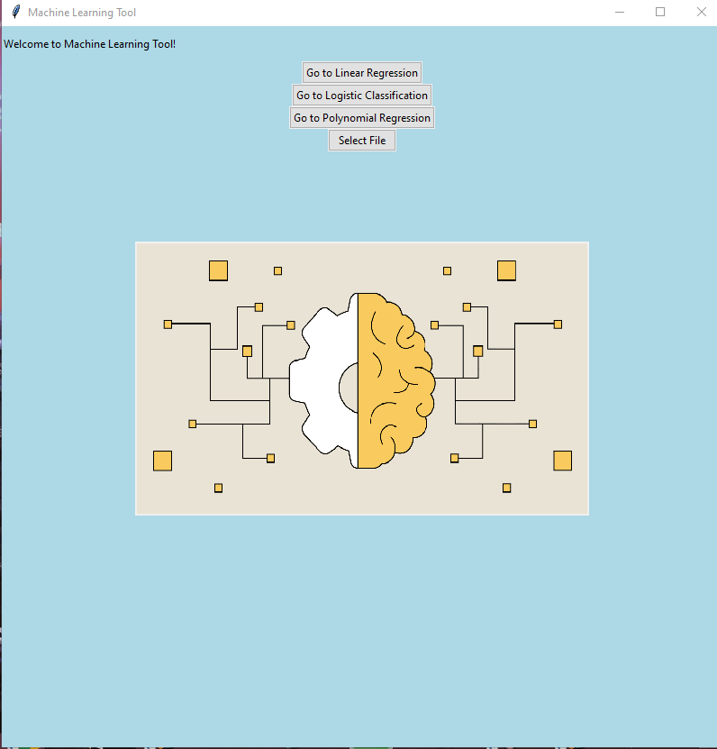

# Machine learning tool

## About the tool

In this project I am creating GUI for using machine learning algorithms in Python. Tkinter library is used for creating user interface, pandas for importing csv data and processing it, numpy for some basic computation, pillow for importing and processing an image and scikit-learn for machine learning methods. In the csv_files directory are some of the datasets that you can use for performing the algorithms.

## Requierements

Tkinter is part of the standard Python library. How to install pandas, numpy, pillow and scikit-klearn in terminal using pip is shown down bellow. 
```
pip install pandas
pip install numpy
pip install scikit-learn
pip install pillow
```

## What is coming next

I will constantly update the code and add new algorithms. Next on my list is implementing a way to export fitting results in a .json or .txt format. I will also constantly add new algorithms for example KNN, support vector machines, decission trees, clustering, principal component analysis and so on. 

## Short guide on how to use the application

First image is showing the start page where you can choose between linear or polynomial regression or logistic classification. You will also need to provide a .csv with your data. Data has to be organized into columns where the last column is your label and all other are your features.



In the next slide we have for example linear regression page. Only input on this page is the desired train test split, a number between 0 and 1. After that you have to click on the 'Fit!' button and not just press enter or else it won't work.


After the algorithm does its job of splitting, training and fitting the data and also calculating important quantities for us, you will get the back evaluation metrics and coefficients of all features. In the future, the metrics and coefficients will be able to be saved if needed. 


